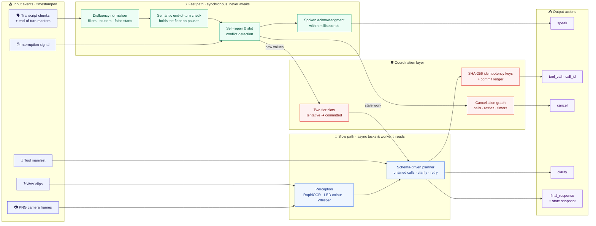
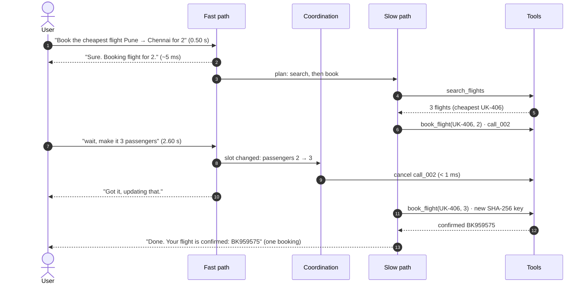

# Audient — Dual-Path Full-Duplex Agent with Dynamic Cancellation

Samsung PRISM GenAI Hackathon 2026–27 · **Theme 05: Interruptible Real-Time Agents**

Audient is an event-driven agent that keeps talking to the user while tools run, and drops
superseded work the moment the user corrects themselves. It reads timestamped events from one async
queue (transcript chunks with end-of-turn markers, WAV clips, PNG frames, interruption signals, tool
results, tool manifests) and writes actions to another (spoken fillers/acks/progress, tool calls with
explicit `call_id`, cancellations, clarifications, final responses with a state snapshot).

## Demo video & presentation

* **Demo video (≤ 5 min):** [Google Drive folder](https://drive.google.com/drive/folders/16Jqalua3wP0c1ag2Fa3MNCiXJdr55boL)
* **Presentation:** [docs/SRMIST_krenos_Submission.pptx](docs/SRMIST_krenos_Submission.pptx)

## Quick start

```bash
pip install -r requirements.txt
python run_eval.py                      # full suite: Audient vs. half-duplex baseline
python run_eval.py --agent audient --show T04   # timestamped trace + every check for one scenario
python -m pytest -q tests               # unit tests
./run_evaluation.sh                     # all of the above in one command (bash)
docker compose up --build               # container run (see "Verification status")
```

Outputs: `reports/results.json` (scores, per-check pass/fail, latencies) and `reports/traces/*.json`
(the full event/action trace of every run).

## Architecture



**A correction mid-booking** (scenario T04, times from a real run):



| Module | Role |
|---|---|
| `audient/agent.py` | Fast/slow/coordination layers, `CancelGraph`, two-tier slot snapshots, idempotency |
| `audient/nlu.py` | Deterministic, schema-driven NLU: disfluencies (fillers, pauses, stutters, false starts, self-corrections), entities, intent routing, parameter typing from the manifest (works for unseen tools) |
| `audient/perception.py` | Frame OCR (error codes, model numbers), LED colour, darkness/blur checks; optional Whisper ASR |
| `audient/vclock.py` | Virtual-time asyncio loop: idle waits are skipped, **real CPU time is charged** to the clock |
| `audient/harness/` | Streaming replay harness, deterministic mock tools with latency + fault injection, scorer |
| `audient/baseline.py` | Half-duplex baseline using the same NLU and OCR (isolates the architecture) |
| `audient/protocol.py` | Event/action schema, validation, and `adapt_event` (single place to map another field naming) |

**Why a virtual clock:** latency and the 15 ms cancellation grace are measured on a clock that includes
all real compute (NLU on the loop thread, OCR/ASR in worker threads), but not idle waiting for mock
tools — so the whole suite replays in seconds and the numbers are still honest.

## Results (measured on this repo's suite)

15 scenarios (12 text, 3 visual): self-correction, barge-in, mid-booking change, clarification, fault +
retry, unseen tool, user cancel, acoustic pause, stutter/false start, speculative prefetch, in-car
destination change, frame OCR, dark frame, multimodal self-repair. Scoring mirrors the guide:
Task 40 / Interruption 35 / Latency 15 / Safety 10, quality multiplier 0.8–1.2, multimodal 1.5×,
cancel grace 15 ms, floor target 250 ms.

| Metric | Audient | Half-duplex baseline |
|---|---|---|
| Scenarios with every check passing | **15 / 15** | 1 / 15 |
| Weighted score, before quality multiplier | **100.0** | ≈75 |
| First spoken response after a user turn (median) | **< 1 ms** (max 17.8 ms, while OCR runs) | ≈ 1.5 s (max 3.4 s) |
| Cancel latency after a correction | **≤ 15 ms** in every run (≈ 14 ms worst, while OCR runs) | never cancels |
| Double bookings | **0** | 1 |

## Verification status (read this)

* The **official evaluation kit was not released** when this was built. The event/action schema and
  the scorer are our reconstruction of the Theme 05 guide; `protocol.adapt_event` is where to adapt field names.
* The suite was **written by us and the agent was developed against it**, so 15/15 shows the mechanisms
  work, not how the agent will do on the hidden ~60-scenario set.
* **Audio:** the Whisper path is implemented but **not benchmarked** — the model was not downloaded in
  the build environment. Without it, audio turns get an explicit "didn't catch that" clarification.
* **Docker:** `Dockerfile` / `docker-compose.yml` are provided but were **not built** (no Docker on the
  build machine). Tests and benchmark were run natively on Python 3.13.3 (code avoids >3.10 features).
* Not used: LiveKit/WebRTC, VAD models, cloud ASR/TTS, and hosted LLMs. The slow-path planner is deterministic
  and schema-driven; no API keys are needed.
* LED **blink counting** across frames is not implemented; blink patterns come from speech
  ("blinking blue twice"), the colour from the frame.

## Web demo (local or Vercel)

`public/index.html` + `api/run.py` run the real agent on the 12 text scenarios (and on turns you type),
side by side with the half-duplex baseline. It needs only the Python standard library.

* **Local:** `python api/run.py` → open http://localhost:8000
* **Vercel:** import the GitHub repo at vercel.com → *Add New → Project*, framework preset **Other**, no build
  command → **Deploy**. Or from a terminal: `npx vercel` then `npx vercel --prod`.
  `public/` is served as the page and `api/run.py` becomes the Python function; `.vercelignore` keeps the heavy
  OCR dependencies out. Camera (V*) scenarios need OCR, so they run only locally via `run_eval.py`.
