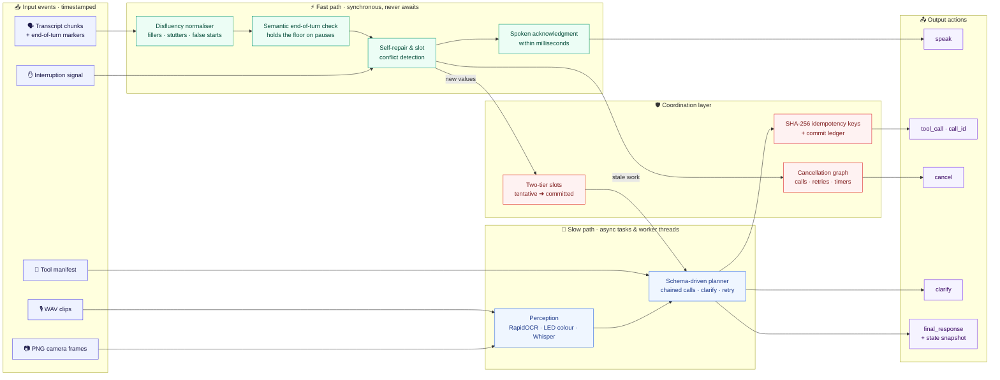
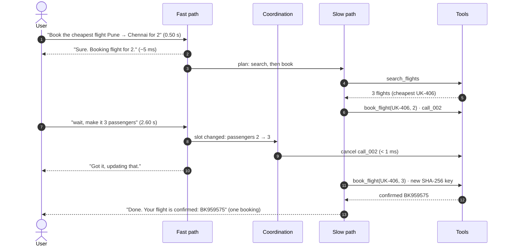
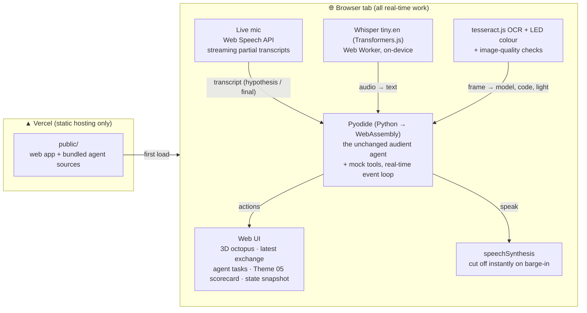

# Audient — Dual-Path Full-Duplex Agent with Dynamic Cancellation

Samsung PRISM GenAI Hackathon 2026–27 · **Theme 05: Interruptible Real-Time Agents**

Audient is an event-driven agent that keeps talking to the user while tools run, and drops
superseded work the moment the user corrects themselves. It reads timestamped events from one async
queue (transcript chunks with end-of-turn markers, WAV clips, PNG frames, interruption signals, tool
results, tool manifests) and writes actions to another (spoken fillers/acks/progress, tool calls with
explicit `call_id`, cancellations, clarifications, final responses with a state snapshot).

## Demo video & presentation

* **Demo video (≤ 5 min):** [Google Drive folder](https://drive.google.com/drive/folders/16Jqalua3wP0c1ag2Fa3MNCiXJdr55boL)
* **Presentation:** [docs/SRMIST_krenos_Submission.pptx](docs/SRMIST_krenos_Submission.pptx)

## Quick start

```bash
pip install -r requirements.txt
python run_eval.py                      # full suite: Audient vs. half-duplex baseline
python run_eval.py --agent audient --show T04   # timestamped trace + every check for one scenario
python -m pytest -q tests               # unit tests
python api/run.py                       # web app: talk to the agent at http://localhost:8000
./run_evaluation.sh                     # all of the above in one command (bash)
docker compose up --build               # container run (see "Verification status")
```

Outputs: `reports/results.json` (scores, per-check pass/fail, latencies) and `reports/traces/*.json`
(the full event/action trace of every run).

## Architecture



**A correction mid-booking** (scenario T04, times from a real run):



| Module | Role |
|---|---|
| `audient/agent.py` | Fast/slow/coordination layers, `CancelGraph`, two-tier slot snapshots, idempotency |
| `audient/nlu.py` | Deterministic, schema-driven NLU: disfluencies (fillers, pauses, stutters, false starts, self-corrections), entities, intent routing, parameter typing from the manifest (works for unseen tools) |
| `audient/perception.py` | Frame OCR (error codes, model numbers), LED colour, darkness/blur checks; optional Whisper ASR |
| `audient/vclock.py` | Virtual-time asyncio loop: idle waits are skipped, **real CPU time is charged** to the clock |
| `audient/harness/` | Streaming replay harness, deterministic mock tools with latency + fault injection, scorer |
| `audient/baseline.py` | Half-duplex baseline using the same NLU and OCR (isolates the architecture) |
| `audient/protocol.py` | Event/action schema, validation, and `adapt_event` (single place to map another field naming) |
| `audient/live.py` | Real-time session (agent + mock tools on the running event loop) and the bridge for browser perception |
| `public/`, `api/run.py` | Web app (see [Web app](#web-app-talk-to-the-agent)) and the local server / replay API |

**Why a virtual clock:** latency and the 15 ms cancellation grace are measured on a clock that includes
all real compute (NLU on the loop thread, OCR/ASR in worker threads), but not idle waiting for mock
tools — so the whole suite replays in seconds and the numbers are still honest.

## Results (measured on this repo's suite)

15 scenarios (12 text, 3 visual): self-correction, barge-in, mid-booking change, clarification, fault +
retry, unseen tool, user cancel, acoustic pause, stutter/false start, speculative prefetch, in-car
destination change, frame OCR, dark frame, multimodal self-repair. Scoring mirrors the guide:
Task 40 / Interruption 35 / Latency 15 / Safety 10, quality multiplier 0.8–1.2, multimodal 1.5×,
cancel grace 15 ms, floor target 250 ms.

| Metric | Audient | Half-duplex baseline |
|---|---|---|
| Scenarios with every check passing | **15 / 15** | 1 / 15 |
| Weighted score, before quality multiplier | **100.0** | ≈75 |
| First spoken response after a user turn (median) | **0.6 ms** (max 5.1 ms) | ≈ 1.4 s (max 3.4 s) |
| Cancel latency after a correction | **≤ 2 ms** (0.4–1.7 ms) | never cancels |
| Double bookings | **0** | 1 |

Latencies are measured from the moment the agent receives an event. The harness reports separately how
late its own timer delivered each event (`harness_delivery_lag_ms`, up to ~15 ms on Windows, whose timer
ticks every 15.6 ms). Camera OCR runs in a separate process (`ProcessPerception`): run in a thread, its
Python pre/post-processing held the GIL and delayed the agent by 10–23 ms (measured, 4 of 6 runs over the
15 ms grace).

## Verification status (read this)

* The **official evaluation kit was not released** when this was built. The event/action schema and
  the scorer are our reconstruction of the Theme 05 guide; `protocol.adapt_event` is where to adapt field names.
* The suite was **written by us and the agent was developed against it**, so 15/15 shows the mechanisms
  work, not how the agent will do on the hidden ~60-scenario set.
* **Audio in the Python benchmark** is implemented but **not benchmarked**: the Whisper model isn't installed
  in the build environment, so audio turns get an explicit "didn't catch that" clarification. In the **web app**,
  on-device Whisper tiny.en was tested on one synthetic (Windows text-to-speech) clip; the live microphone uses
  the browser's speech service and can't be tested headlessly (no microphone).
* **Docker:** `Dockerfile` / `docker-compose.yml` are provided but were **not built** (no Docker on the
  build machine). Tests and benchmark were run natively on Python 3.13.3 (code avoids >3.10 features).
* Not used: LiveKit/WebRTC, VAD models, cloud ASR/TTS, and hosted LLMs. The slow-path planner is deterministic
  and schema-driven; no API keys are needed.
* LED **blink counting** across frames is not implemented; blink patterns come from speech
  ("blinking blue twice"), the colour from the frame.

## Web app (talk to the agent)

Talk to the agent, type to it, upload a voice clip or show it a camera frame, and interrupt it while it
works. One screen, three parts:

* **Centre:** the agent, a real-time 3D octopus (Three.js, built in code, no video). It turns its body
  and eyes toward your cursor, and its arms move on random noise, so the motion never repeats. Its
  mood follows the agent: listening, thinking, speaking, or a red flash when you interrupt. Under it:
  the latest exchange ("You …" / "Audient …") and the input bar with a big mic button.
* **Left, Agent Tasks:** every tool call in plain language ("Book flight UK-406 · 3 passengers") with an
  *In progress / Completed / Cancelled* status and how fast a cancelled task was stopped. Below that,
  four one-click interruption demos.
* **Right, Interruptible Voice Agent:** the tool manifest (a dot marks tools that change something, which
  run exactly once); a live **Theme 05 scorecard** using the theme's weights: Latency 15 % (first spoken
  reply, with a sparkline), Interruption 35 % (time to drop stale work), Tasks 40 % (completed and
  cancelled) and Safety 10 % (duplicate writes); and the agent's **state snapshot** (intent, status and
  slot values, with tentative slots dashed).

```bash
python scripts/build_web.py   # after changing anything in audient/ (bundles the agent for the browser)
python api/run.py             # local server -> http://localhost:8000
```

**Deploy to Vercel:** import the repo at vercel.com (*Add New → Project*) and click **Deploy**, or run
`npx vercel --prod` in the repo. It is a purely static site: `vercel.json` serves `public/`, and
`.vercelignore` leaves out everything else (the browser runs the agent from `public/py/bundle.json`).
Not yet deployed and tested on Vercel by us; everything below was tested locally in headless Edge.

### System design: why the agent runs in the browser



A live conversation is stateful and timer-driven: the agent keeps in-flight calls, retry timers and
hold-the-floor timers alive between events. Vercel functions are request/response; WebSockets are in
public beta, pinned to one instance and capped at 5 minutes on Hobby; and a Whisper + PyTorch stack would
need the large-function beta. So the stateful, latency-critical loop runs in the browser, perception
runs there too (in workers, so the fast path never blocks), and Vercel only serves static files.
The browser runs the **same Python files** the benchmark scores
(`scripts/build_web.py` bundles them), so there is no second implementation to drift.

| Input | How it reaches the agent | Where it runs |
|---|---|---|
| Live microphone | Web Speech API interim results → revisable `hypothesis` transcripts, finals end the turn; talking over the agent stops its speech and sends an `interruption` | browser's speech service (Chrome/Edge send audio to their cloud; Firefox has no support) |
| Recorded or uploaded clip (WAV/MP3/WebM) | `audio` event → agent's own audio path → Whisper tiny.en | on-device (Web Worker), model downloaded on first use |
| Camera frame (sample or uploaded photo) | `frame` event → OCR + LED + darkness/blur → model / code / indicator | on-device |
| Typing | final transcripts | – |

**Verified** with `node tests/web/e2e.mjs` (headless Edge, 19/19 checks): agent boots in ~6–8 s; booking
corrected mid-flight with one write; camera frame read (WM-3000, E20) and the stale lookup cancelled;
no premature action during "um…"; speculative search before the turn ends; unseen tool; typed input;
the octopus turns toward the cursor, keeps moving its arms while the cursor is still, and reacts to the agent's state; no horizontal scroll at phone width; no JavaScript errors. In the browser the agent
answers in ~4–30 ms (WebAssembly is slower than native Python's ~1 ms, still far under the 250 ms target).

**Limits:** first visit downloads the Python runtime (~7–9 s here); OCR and Whisper models download on first
use; the mic streams live in Chrome/Edge and records on-device Whisper clips in other browsers; without
headphones the mic may hear the agent's own voice (an echo filter ignores speech that matches what the
agent is saying, but it isn't perfect). Benchmark replays live in `run_eval.py`, not in the web UI.

Research behind these choices: [Vercel function limits](https://vercel.com/docs/functions/limitations),
[WebSockets on Vercel](https://ably.com/vercel/websockets-on-vercel),
[OpenAI Realtime Console](https://github.com/openai/openai-realtime-console),
[LiveKit agent state](https://docs.livekit.io/frontends/build/agent-state/),
[Pipecat metrics](https://docs.pipecat.ai/pipecat/fundamentals/metrics),
[MDN SpeechRecognition](https://developer.mozilla.org/en-US/docs/Web/API/SpeechRecognition),
[Whisper tiny.en for Transformers.js](https://huggingface.co/Xenova/whisper-tiny.en).
