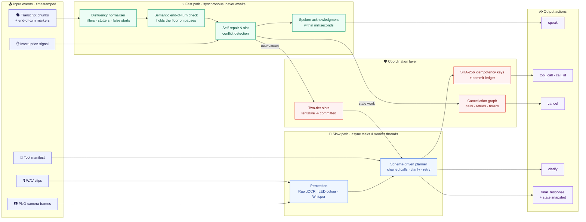
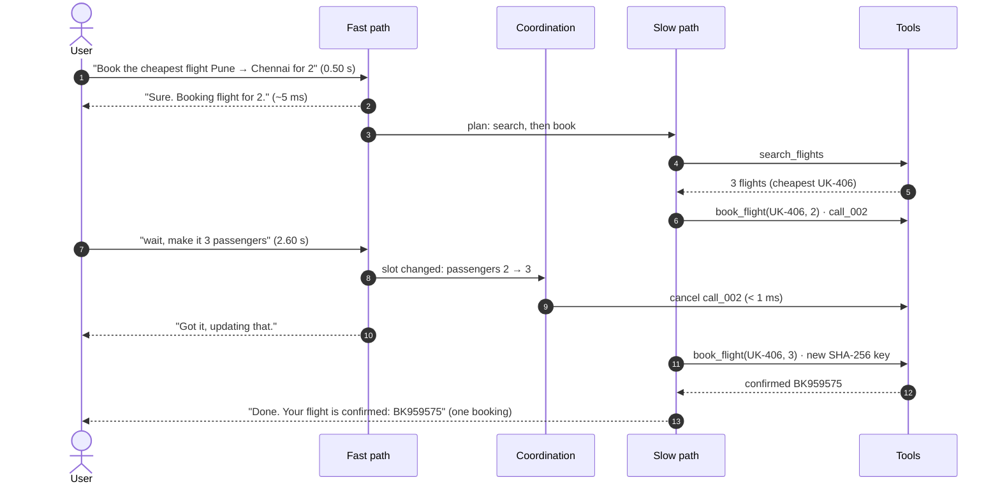
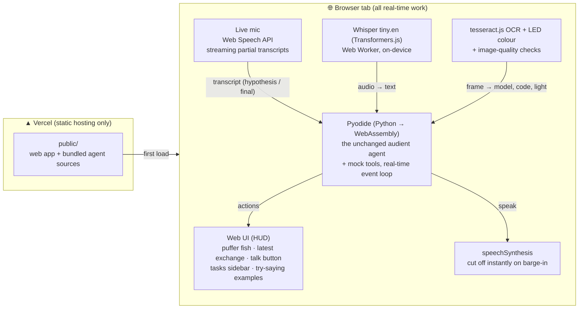

# Audient: Dual-Path Full-Duplex Agent with Dynamic Cancellation

Samsung PRISM GenAI Hackathon 2026–27 · **Theme 05: Interruptible Real-Time Agents**

Audient is an event-driven agent that keeps talking to the user while tools run, and drops
superseded work the moment the user corrects themselves. It reads timestamped events from one async
queue (transcript chunks with end-of-turn markers, WAV clips, PNG frames, interruption signals, tool
results, tool manifests) and writes actions to another (spoken fillers/acks/progress, tool calls with
explicit `call_id`, cancellations, clarifications, final responses with a state snapshot).

> **Updated guide (Full-Duplex-Bench v3):** the benchmark now scored is FDB-v3, run against a LiveKit voice agent.
> Audient as that agent, its model-provider and key declaration, and the one-command benchmark run are in
> [fdb_agent/README.md](fdb_agent/README.md) and summarised in the next section. The sections after it describe
> the original queue-based agent, which the web app and the extension use cases build on.

## Full-Duplex-Bench v3 (the scored benchmark)

[FDB-v3](https://github.com/DanielLin94144/Full-Duplex-Bench/tree/main/v3) streams 100 real human recordings
(79 scenarios, 4 domains, fillers, pauses, false starts and self-corrections) into a LiveKit room. The agent answers
by voice and calls 12 mock tools. FDB-v3's own scorers then check which calls were made.

**Model provider (declaration):** Google **Gemini 2.5 Flash native audio**
(`gemini-2.5-flash-native-audio-preview-12-2025`) over the Gemini Live API, through LiveKit's Google plugin;
transport by **LiveKit Cloud**. Keys: `GOOGLE_API_KEY`, `LIVEKIT_URL`, `LIVEKIT_API_KEY`, `LIVEKIT_API_SECRET`
(none are in the repository). At evaluation time the agent calls only Gemini and LiveKit, no server of ours, and
nothing is cached across scenarios or written for particular benchmark items.

**What Audient adds:** the speech model, voice and tool definitions are the same as FDB-v3's own `gemini2_5`
template, which is the baseline. Between the model and the tools sits Audient's coordination layer
([fdb_agent/coordination.py](fdb_agent/coordination.py)):

* **hold, then commit:** a tool call runs once the user has been quiet for 2.0 s, so a call made during a pause in
  the middle of a sentence waits for the rest of it;
* **defer, don't drop:** if the user starts talking again first, the call waits; it is dropped only if they said a
  correction ("wait", "actually", "instead"...) and the model has since made a newer call to the same tool;
* **never repeat:** an identical call is executed once and its result reused.

A local voice activity detector (Silero) on the user's audio tells the layer when the user is speaking.

**Run it (one command, after a one-time setup; Linux or GitHub Codespaces):**

```bash
bash fdb_agent/setup.sh                       # once: FDB-v3 at the tested commit, its data, Python 3.10 environment
bash fdb_agent/run_benchmark.sh audient       # all 100 recordings, about an hour
bash fdb_agent/run_benchmark.sh gemini2_5     # FDB-v3's unchanged Gemini template (baseline)
```

Scores, per-recording results, the tool-call log, the agent log and the run configuration are written to
`reports/fdb/<agent>/`. [fdb_agent/compare_runs.py](fdb_agent/compare_runs.py) compares two runs recording by
recording; [fdb_agent/silent_report.py](fdb_agent/silent_report.py) explains recordings without a reply.

**Results so far** (all 100 recordings, GitHub Codespaces, arguments compared exactly; we have no OpenAI key for
FDB-v3's optional GPT-4o judge, so these are stricter than a judged run):

| Run | Strict pass rate | Self-correction | Hard (3-tool chains) | No reply | Avg latency |
|---|---|---|---|---|---|
| FDB-v3 Gemini 2.5 template (baseline) | 47.0% | 41.2% | 40.0% | 1 | 13.2 s |
| Audient, first full run | 47.0% | 64.7% | 26.7% | 6 | 13.0 s |
| Audient, hold timed from the end of speech | 47.0% | **70.6%** | 36.7% | 18 | **12.1 s** |
| Audient, hold driven by the local voice detector | *run in progress* | | | | |

The layer does what it was built for: self-corrections improve by 23 to 29 points. That gain was cancelled out by
recordings where the agent never replied. The cause was found in LiveKit's Gemini plugin (1.8.4): it reports that
the user started speaking whenever Gemini starts a reply, and that they stopped only when the reply ends. A call
made inside a reply therefore looked as if the user was still talking and was held for the 20 s safety limit,
often past the end of the recording. The layer now listens to the user's audio itself. On a recording that had
been silent, the agent now replies, but one recording proves nothing about the overall score. The full run is in
progress, and this table will be updated with its result either way.

## Demo video & presentation

* **Demo video (≤ 5 min):** [Google Drive folder](https://drive.google.com/drive/folders/16Jqalua3wP0c1ag2Fa3MNCiXJdr55boL)
* **Presentation:** [docs/SRMIST_krenos_Submission.pptx](docs/SRMIST_krenos_Submission.pptx)

## Quick start

```bash
pip install -r requirements.txt -r requirements-asr.txt   # Python 3.10-3.13
python run_eval.py                      # full suite: Audient vs. half-duplex baseline
python run_eval.py --agent audient --show T04   # timestamped trace + every check for one scenario
python -m pytest -q tests               # unit tests + free-form suites
python scripts/eval_freeform.py -v      # unscripted requests (dev / held-out / blind sets), every reply printed
python api/run.py                       # web app: talk to the agent at http://localhost:8000
./run_evaluation.sh                     # all of the above in one command (bash)
docker compose up --build               # container run (see "Verification status")
```

Outputs: `reports/results.json` (scores, per-check pass/fail, latencies) and `reports/traces/*.json`
(the full event/action trace of every run).

## Architecture



**A correction mid-booking** (scenario T04, times from a real run):



| Module | Role |
|---|---|
| `audient/agent.py` | Fast/slow/coordination layers, `CancelGraph`, two-tier slot snapshots, idempotency |
| `audient/nlu.py` | Deterministic, schema-driven NLU: disfluencies (fillers, pauses, stutters, false starts, self-corrections), entities, intent routing, parameter typing from the manifest (works for unseen tools) |
| `audient/perception.py` | Frame OCR (error codes, model numbers), LED colour, darkness/blur checks; Whisper base.en speech recognition (int8, downloaded in the warm-up hook if not cached) |
| `audient/vclock.py` | Virtual-time asyncio loop: idle waits are skipped, **real CPU time is charged** to the clock |
| `audient/harness/` | Streaming replay harness, deterministic mock tools with latency + fault injection, scorer |
| `audient/baseline.py` | Half-duplex baseline using the same NLU, OCR and speech recognition (isolates the architecture) |
| `audient/protocol.py` | Event/action schema, validation, and `adapt_event` (single place to map another field naming): reads tool manifests in OpenAI, MCP (`inputSchema`, `readOnlyHint`) and flag styles, and tool results with other field names |
| `audient/live.py` | Real-time session (agent + mock tools on the running event loop) and the bridge for browser perception |
| `public/`, `api/run.py` | Web app (see [Web app](#web-app-talk-to-the-agent)) and the local server / replay API |

**Why a virtual clock:** latency and the 15 ms cancellation grace are measured on a clock that includes
all real compute (NLU on the loop thread, OCR/ASR in worker threads), but not idle waiting for mock
tools, so the whole suite replays in seconds and the numbers are still honest.

## Results (measured on this repo's suite)

21 scenarios (12 text, 6 audio, 3 visual; the guide's mix is 50/30/20): self-correction, barge-in,
mid-booking change, clarification, fault + retry, unseen tool, user cancel, acoustic pause, stutter/false
start, speculative prefetch, in-car destination change, frame OCR, dark frame, multimodal self-repair, and
the audio versions: a spoken request, spoken self-correction, spoken mid-booking change, silence, spoken
in-car change and a spoken support ticket. Scoring mirrors the guide: Task 40 / Interruption 35 /
Latency 15 / Safety 10, quality multiplier 0.8-1.2, multimodal 1.5x, cancel grace 15 ms, floor target 250 ms.

| Metric | Audient | Half-duplex baseline |
|---|---|---|
| Weighted score (before quality multiplier) | **100.0** (97.4) | 87.1 (75.6) |
| Scenarios passing every task, interruption and safety check | **21 / 21** | 2 / 21 pass every check |
| First spoken response, text and camera turns (median) | **1.0 ms** (max 3.2 ms) | 1.6 s (max 3.4 s) |
| First spoken response, audio turns (median) | **1.03 s** (speech recognition) | 3.8 s (max 6.8 s) |
| Cancel after a typed correction | **0.5-2.8 ms** | never cancels |
| Cancel after a spoken correction (from the clip arriving) | **0.93-1.06 s** | never cancels |
| Double bookings | **0** | 2 (T04, A03) |

Audio clips (`assets/audio/`, made by `scripts/make_audio.py` with the Windows voices) are transcribed
by Whisper base.en with int8 weights: about 0.8-0.9 s per clip on this CPU (fp32 was ~1.4 s; tiny.en
was ~0.7 s but misheard "Goa" as "go at"). That time is real and counted: the five spoken-turn scenarios
get partial latency credit, so 16 / 21 scenarios pass every check including latency. A spoken correction
can only be acted on after it is transcribed, so those cancels are graded from the clip's arrival with a
1.5 s grace (`grace_s`) and the measured time is reported (`cancel_after_correction_ms`). Before acting, the
agent says a short acknowledgment ("Mm-hm, one moment."), varied so two clips don't get the same words.
Known miss: with these voices, "Pune to Chennai" was heard as "Pun to Genetomaro" by both Whisper models.

Latencies are measured from the moment the agent receives an event. The harness reports separately how
late its own timer delivered each event (`harness_delivery_lag_ms`, up to ~15 ms on Windows, whose timer
ticks every 15.6 ms). Camera OCR and speech recognition run in a separate process (`ProcessPerception`):
run in a thread, OCR's Python pre/post-processing held the GIL and delayed the agent by 10-23 ms (measured,
4 of 6 runs over the 15 ms grace).

## Free-form requests (beyond the scripted scenarios)

The 21 scenarios show the interruption mechanics work. They don't show what happens with requests nobody
wrote a scenario for, so `scripts/eval_freeform.py` runs unscripted requests through the same live session
the web app uses (same agent, mock tools and manifest) and checks the tool calls, commits and final reply.
There are three sets in `tests/freeform/`, all session-dated 2026-10-02 (runs saved in
`reports/freeform_before.json`, `reports/freeform_blind_firstrun.json` and `reports/freeform.json`):

| Set | Cases | How it was used | Before (commit 227bfe0) | Now |
|---|---|---|---|---|
| dev | 36 | the fixes were made against it | 11 / 36 | **36 / 36** |
| held-out | 31 | frozen before the fixes; its failures were visible while working | 13 / 31 | **31 / 31** |
| blind | 26 | frozen before the fixes; first run only after they were done | 11 / 26 | **23 / 26** on first run, 26 / 26 after fixing the 3 bugs it found |

The blind first run (23 / 26) is the fairest estimate. Its three failures were real bugs: a place word
inside a name ("Cubbon **Park**" became "park"), a speech-recognition fix that turned "Smoke House Deli"
into "Delhi", and "turn on the lights" sent to the manual lookup. All three sets were written by us,
so they share our blind spots.

What changed (all rule-based and offline, no LLM; the per-turn NLU cost stayed at ~0.4 ms):

* **Understanding:** more cities (with airport codes), any capitalised place after "from"/"to"
  ("Phoenix Marketcity", "Indore"), numeric and ordinal dates ("12/10" day-first, "the 15th"), Hindi
  day words and "se" as "from" ("Kal Delhi se Mumbai ki flight"), "get me to …", AM/PM from context
  ("a table at 7" is 19:00), contractions ("isn't").
* **Conversation:** "book the second one" books from the results already shown; "what time does the
  cheapest one leave?" is answered from them with no new call; "book the cheapest of those flights"
  works after a detour; two requests in one sentence run one after the other; "okay" while it works is
  a backchannel, not a new request.
* **Listening, not following a script:** if a follow-up changes nothing it understands, it says "Sorry,
  I didn't get that" (or "I don't have that information" for a question) instead of re-running the last
  task; "let me think" gets "Sure, take your time"; "no, that's not what I wanted" gets "What should I
  change?"; "tell me about the IndiGo one" describes just those results.
* **Scope:** greetings and "what can you do?" list the tools from the manifest; requests no tool can
  serve ("book a cab", "what's the weather") get "I can't do that with the tools I have" instead of a
  wrong tool call.
* **Replies:** dates are spoken ("tomorrow", "on Friday 9 October"; slots stay ISO), results are listed
  rather than calling the first one "best", and confirmations name what was booked.

Still out of reach for the rules: phrasings far from the tools' wording, places in lower case outside
navigation phrases, and anything that needs world knowledge.

## Verification status (read this)

* The **official evaluation kit was not released** when this was built. The event/action schema and
  the scorer are our reconstruction of the Theme 05 guide; `protocol.adapt_event` is where to adapt field names.
  Manifests in other common formats are already understood (`tests/test_manifest_formats.py` replays the
  state-changing scenarios with OpenAI-style, MCP-style and `read_only`-flag manifests: same score, one commit).
  A tool that declares nothing is judged by its verb (`search_` read-only, `book_` state-changing); an unknown
  verb counts as state-changing, the safe side for never repeating a write.
* The suite was **written by us and the agent was developed against it**, so 21/21 shows the mechanisms
  work, not how the agent will do on the hidden ~60-scenario set.
* **Audio** is benchmarked with synthetic speech (Windows text-to-speech, two US voices), not recorded human
  speech or accents. The speech model (~290 MB) is fetched during the warm-up hook if it is not cached, which
  needs internet once; with `AUDIENT_OFFLINE=1` and no cached model, audio turns get a clarification. In the
  **web app**, on-device Whisper tiny.en handles recorded clips; the live microphone uses the browser's speech
  service and can't be tested headlessly (no microphone).
* **Python versions:** tests (36) and the full benchmark pass on **Python 3.10.22, 3.12.15 and 3.13.3**
  (Windows 11). Python 3.10 gets numpy 2.2.6 / onnxruntime 1.23.2 (the pinned newer ones need 3.11+).
* **Docker:** `Dockerfile` / `docker-compose.yml` are provided but were **not built** (no Docker on the
  build machine).
* The queue-based agent below uses no LiveKit/WebRTC, VAD models or cloud ASR/TTS (the FDB-v3 agent above does
  use LiveKit, Gemini Live and a Silero VAD). The benchmark and the free-form numbers above use the
  deterministic rule parser and need no API keys. A hosted language model can be connected to the **web app**
  (next section); it has been measured with real Gemini (see "Measured with real Gemini" below).
* LED **blink counting** across frames is not implemented; blink patterns come from speech
  ("blinking blue twice"), the colour from the frame.

## Everyday assistant (web app domain)

Besides the benchmark's tools (flights, tickets, routes, manuals, tables), the web app's agent has everyday
tools (`scenarios/manifest_assistant.json`): **weather** (live, from Open-Meteo: real forecasts, no key),
**places near you** (live: the nearest cinema, hospital, pharmacy, ATM, petrol pump, restaurant... from
OpenStreetMap), alarms, timers, reminders, calendar events, notes, messages, calls, music, **smart-home control**
(lights, AC, fan, TV: on, off, set a level) and cabs. In the web app **directions are live too**: real driving
time and distance from OpenStreetMap's router (OSRM), to "the nearest X", a place it just listed, or a named
place. Weather, places and directions are real; the rest are simulated, like the flights, because the real
services (music, messaging, rides, smart home) need accounts and keys.

**Location and privacy:** the browser's location is read only when a request needs it (nearby search,
directions), after the browser asks permission; the coordinates go to the OpenStreetMap services
(Overpass, OSRM, Nominatim) and nowhere else. Without permission the agent says so and offers to search near
a named area ("pharmacies near Koregaon Park"). It has no saved home or office address and says so rather than
guessing. All
of them go through the same engine, so "set an alarm for 7… actually 7:30" or "set the AC to 22… make it 24"
cancels the stale call in the same tick and sets it exactly once. The intro describes these areas (plus general
questions when a language model is connected). The benchmark and its scores still use only the core tools.

`tests/freeform/assistant.json` (24 requests, written with this domain and used while building it):
rule parser **23/24** (the 20 everyday requests were measured with real Gemini at **19/20**; on the four
nearby-place requests plus two more phrasings Gemini picks the places tool every time, 5/6 on exact
arguments: it says "nearest hospital" where the test expects "hospital", which the live route tool resolves
the same way). Each misses one: the rules can't answer "Who wrote the
Ramayana?" (Gemini: "…the sage Valmiki"); Gemini's greeting summarised the areas as "flights, reminders,
weather, and more" instead of naming the smart home. Gemini also extracts what the rules can't, e.g. the
message "I'll be late" from "Text Rahul that I'll be late", or "Meeting with Priya" as the event title.

## Language model (optional, for the web app)

With a model connected, the model understands what the user says (intent, values, which result they mean,
whether they've finished) and writes the spoken replies. The real-time engine stays in charge of timing and
safety, so a model can't break them:

* **Instant reactions stay rule-based.** In the same tick as the user's words, the agent cancels work that a
  correction contradicts ("make it 3" while booking for 2) and handles "cancel"; it doesn't wait for the model.
* **The model call is slow-path work.** If the user speaks again, the pending call is dropped and the newest
  turn is understood instead. If the model hasn't replied after 0.6 s the agent says "One moment."; after 4.5 s,
  or on any error, the rule parser handles the turn.
* **The model can't act on its own.** Its output is checked against the tool schemas (names, types, enums,
  dates, times); an id it didn't get from real results is dropped and looked up instead, and bookings still go
  through the exactly-once ledger. "Done" is only ever said by the agent, after the tool confirms.
* With a model, speculative searches from half a sentence are off: it acts on what the user finished saying.

Any provider with an OpenAI-compatible chat-completions endpoint works. Set three environment variables before
starting the server (the key stays on the server; the browser never sees it):

```powershell
$env:AUDIENT_LLM_BASE_URL = "https://api.openai.com/v1"   # or your provider's OpenAI-compatible URL
$env:AUDIENT_LLM_API_KEY  = "<your key>"
$env:AUDIENT_LLM_MODEL    = "<a model name from your provider's list>"
python api/run.py
```

Or put the same lines (`NAME=value`, no `$env:`) in a `.env` file in the project folder: `api/run.py` loads it,
and `.gitignore` / `.vercelignore` keep it out of git and deployments. Optional:
`AUDIENT_LLM_FALLBACK_MODELS=model-a,model-b` is tried in turn when the main model is busy or rate-limited (429/5xx).
We run Google Gemini's `gemini-flash-lite-latest` (median ~1.3 s per turn in our tests) with two fallbacks.

Base URLs we know of (check your provider's docs): OpenAI `https://api.openai.com/v1`, Google Gemini
`https://generativelanguage.googleapis.com/v1beta/openai`, Groq `https://api.groq.com/openai/v1`,
OpenRouter `https://openrouter.ai/api/v1`, a local Ollama `http://localhost:11434/v1` (no key). The page's
page does not show which mode is active (`window.audient.model` does). On Vercel, set the same
variables in the project settings; `api/understand.py` deploys as a function (not yet deployed by us).

**Measured with real Gemini** (`python scripts/eval_freeform.py --model`, one case at a time, 2026-10-02):
dev 34/36, held-out 30/31, blind 26/26; median 1.2 s per model call, 4 of 114 calls cut off by the 4.5 s limit
(the rules answered those turns). The real model also exposed bugs we then fixed (a bare "yes" read as consent to
book, a two-request sentence booking a table twice, "the cheapest flight" only searched); the rules now keep the
final say on exact codes and dates, and when the model wrongly refuses a request a tool clearly covers.
Of the re-checked failures, one remains: asked about traffic, Gemini answers honestly but differently from our
test's wording. In the browser against real Gemini, `tests/web/e2e_model.mjs` passes 8/8.

Tested without a key using `tests/stub_llm.py`, a stand-in OpenAI-compatible server: `tests/test_model_path.py` (the agent
with a scripted model: correction cancelled in the same tick while the model is still thinking, newer turn
replaces the pending call, failure falls back to rules, an invented flight id is never booked),
`tests/test_understand_api.py` (the endpoint, including providers without JSON mode), and
`tests/web/e2e_model.mjs` (in the browser: 8/8).

## Web app (talk to the agent)

Talk to the agent, type to it, upload a voice clip or show it a camera frame, and interrupt it while it
works. One screen in black, white and blue:

* **Centre:** the agent, a 3D puffer fish (Three.js). It swims gently in place, turns to look at your
  cursor and swims toward it, and blinks. While it listens it puffs up into a spiky ball, fuller the louder
  you talk, and deflates when you stop. Its colour shows what it is doing and blends smoothly between states:
  calm blue when idle, cyan and aqua while listening, violet and pulsing while thinking, pink and coral while
  it responds (its mouth moves as it talks), and a golden flash with a startled puff when you interrupt. A
  click is a poke: it puffs up in surprise. Without WebGL it falls back to a 2D ring amoeba.
* **Top:** the AUDIENT wordmark and "Interruptible AI Voice Agent"; the clock on the right.
* **Left sidebar, Tasks:** a button with a count badge (it beats while a task runs and turns amber when the
  agent needs an answer). It opens a panel listing every tool call in plain language ("Book flight UK-406 ·
  3 passengers") with an *In progress / Completed / Cancelled* status and how fast a cancelled task was
  stopped. Close it with the button, the X or Escape; it remembers whether it was open. On a phone the
  button sits at the top right.
* **Right, Try saying:** examples; a click only puts the first sentence in the input box (and shows the
  camera frame it needs); you send it and interrupt it yourself. The agent never speaks or acts unprompted.
* **Bottom:** the exchange ("AGENT: …" / "USER: …"), the rounded TAP TO TALK button (switches hands-free
  listening on; its bars are a live meter of your voice) and a rounded input box. No button is needed to
  interrupt: just talk.

Which language model is in use is not shown on the page; the agent's state snapshot, metrics and trace are
in `window.audient` for debugging and in the benchmark reports.

```bash
python scripts/build_web.py   # after changing anything in audient/ (bundles the agent for the browser)
python api/run.py             # local server -> http://localhost:8000
```

**Deploy to Vercel:** import the repo at vercel.com (*Add New → Project*) and click **Deploy**, or run
`npx vercel --prod` in the repo. It is a purely static site: `vercel.json` serves `public/`, and
`.vercelignore` leaves out everything else (the browser runs the agent from `public/py/bundle.json`).
Not yet deployed and tested on Vercel by us; everything below was tested locally in headless Edge.

### System design: why the agent runs in the browser



A live conversation is stateful and timer-driven: the agent keeps in-flight calls, retry timers and
hold-the-floor timers alive between events. Vercel functions are request/response; WebSockets are in
public beta, pinned to one instance and capped at 5 minutes on Hobby; and a Whisper + PyTorch stack would
need the large-function beta. So the stateful, latency-critical loop runs in the browser, perception
runs there too (in workers, so the fast path never blocks), and Vercel only serves static files.
The browser runs the **same Python files** the benchmark scores
(`scripts/build_web.py` bundles them), so there is no second implementation to drift.

| Input | How it reaches the agent | Where it runs |
|---|---|---|
| Live microphone | Web Speech API interim results → revisable `hypothesis` transcripts, finals end the turn; talking over the agent stops its speech and sends an `interruption` | browser's speech service (Chrome/Edge send audio to their cloud; Firefox has no support) |
| Recorded or uploaded clip (WAV/MP3/WebM) | `audio` event → agent's own audio path → Whisper tiny.en | on-device (Web Worker), model downloaded on first use |
| Camera frame (sample or uploaded photo) | `frame` event → OCR + LED + darkness/blur → model / code / indicator | on-device |
| Typing | final transcripts | – |

**Turn-taking on the mic:** the browser marks a phrase final after a short silence, which is often just a
pause for thought, so a final phrase is held for 0.8 s and merged with whatever follows; fillers ("uh",
"hmm"), low-confidence results and single stray words over the agent's voice are ignored (a clear "stop",
"wait" or "no" still counts).

**Hands-free, interrupt by talking:** one tap turns listening on and it stays on (and comes back on the next
visit). While the agent speaks, a barge-in detector learns the level of its own voice coming back through the
speakers; when the mic level jumps well above that for about 0.2 s, the agent's voice **pauses at once**. If
the recogniser then hears real words (not its own echo), the agent is cut off and any stale work is cancelled;
if it was only noise, the voice resumes after 1.3 s. The detector is tested with synthetic levels; thresholds
for real rooms and speakers have not been tuned on hardware. Headphones avoid echo altogether.

**Voice:** the browser's most natural voice is used (neural "Natural" voices in Edge, then Google voices in
Chrome; Indian English slightly preferred), one sentence at a time, and text is rewritten for the ear first:
"6:45 PM" not "18:45", "3,683 rupees" not "₹3,683", "31 degrees", "3 October", no brackets.

**Verified** with `node tests/web/e2e.mjs` (headless Edge, 36/36 checks): the big button switches
hands-free listening on; the barge-in detector ignores echo-level input and pauses for a louder voice within
~0.2 s; speech text is rewritten naturally; an alarm corrected mid-way ("7 am… actually 7:30") is set once;
the weather comes live from Open-Meteo; the nearest cinema to a set location is found live in OpenStreetMap
and real directions to it come from OSRM; the intro describes the wider domain; left alone for 5 s it does
nothing; an example click only fills the input box; its own last reply heard by the mic is ignored while
real replies are not (the echo has to repeat its sentence in order); long lists are spoken as a summary and
stay on screen; agent boots in ~5–8 s; booking
corrected mid-flight with one write; camera frame read (WM-3000, E20) and the stale lookup cancelled;
no premature action during "um…"; speculative search before the turn ends; unseen tool; typed input;
"book the second one" books the 2nd result shown without a new search; "book a cab" is declined with no
tool call; the Tasks panel opens from the sidebar with a matching count and closes on Escape; the puffer fish turns to a nearby cursor and swims toward it, puffs up while you talk and deflates
after, keeps moving with nothing touching it, and changes colour as the agent thinks and responds; no horizontal scroll at phone width; no JavaScript errors. In the browser the agent
answers in ~4–30 ms (WebAssembly is slower than native Python's ~1 ms, still far under the 250 ms target).

**Limits:** first visit downloads the Python runtime (~7–9 s here); OCR and Whisper models download on first
use; the mic streams live in Chrome/Edge and records on-device Whisper clips in other browsers; without
headphones the mic may hear the agent's own voice (an echo filter ignores speech that matches what the
agent is saying or said in the last 4 s, but it isn't perfect; headphones avoid it entirely). Benchmark replays live in `run_eval.py`, not in the web UI.

Research behind these choices: [Vercel function limits](https://vercel.com/docs/functions/limitations),
[WebSockets on Vercel](https://ably.com/vercel/websockets-on-vercel),
[OpenAI Realtime Console](https://github.com/openai/openai-realtime-console),
[LiveKit agent state](https://docs.livekit.io/frontends/build/agent-state/),
[Pipecat metrics](https://docs.pipecat.ai/pipecat/fundamentals/metrics),
[MDN SpeechRecognition](https://developer.mozilla.org/en-US/docs/Web/API/SpeechRecognition),
[Whisper tiny.en for Transformers.js](https://huggingface.co/Xenova/whisper-tiny.en).
